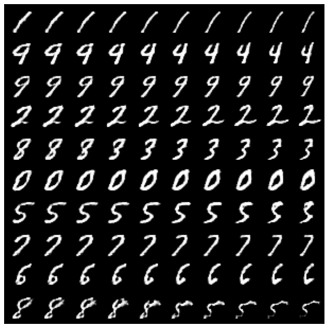
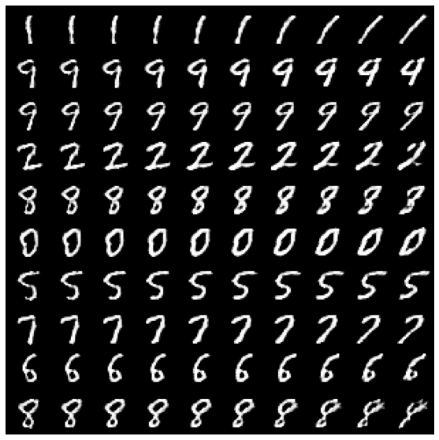

<!-- /TOC -->
## Notice
This is the repo for EECS 6691 course presentation. It contains a PyTorch implementation of InfoGAN on MNSIT dataset. The InfoGAN code from  [this repo](https://github.com/Natsu6767/InfoGAN-PyTorch) was used and most code from that repo is collected into infogan.ipynb. An explicit function for traversing the dimension of our choice was written in addition to the original code. 

For the mutual information term in the paper, minimizing cross entropy loss for discrete variables and maximizing likelihood of the predicted parameters by the Q-network with respect to the sampled latent vectors was done.

A simple 15 epoch training on MNIST dataset gave very good results.  

Below are the visualizations obtained while traversing along the discrete latent unit

Below are the visualizations obtained while traversing along the latent unit corresponding to thickness

Below are the visualizations obtained while traversing along the latent unit corresponding to rotation

For any question, please contact *Sairam Satwik Kondamudi* sk4824
## Acknowledgement
- [InfoGAN](https://arxiv.org/pdf/1606.03657.pdf)
- [Infogan Code source](https://github.com/Natsu6767/InfoGAN-PyTorch)

