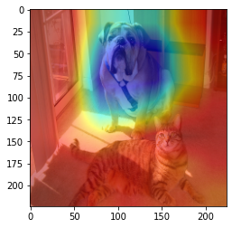
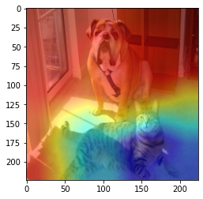

## Notice
This is the repo for EECS 6691 course presentation. It contains a PyTorch implementation of Grad-CAM. The GradCAM code from  [this repo](https://github.com/jacobgil/pytorch-grad-cam) was used and most code from that repo is collected into Grad_CAM.ipynb. 

A sample image both.png was used in the experiment.

Below is the visualization of the last convolution layer for the predicted class label.

Below is the visualization of the last convolution layer for the 'tabby, tabby cat' class label.

For any question, please contact *Sairam Satwik Kondamudi* sk4824
## Acknowledgement
- [Grad-CAM](https://openaccess.thecvf.com/content_ICCV_2017/papers/Selvaraju_Grad-CAM_Visual_Explanations_ICCV_2017_paper.pdf)
- [Grad-CAM Code source](https://github.com/jacobgil/pytorch-grad-cam)

